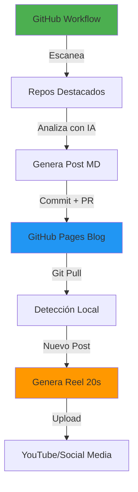

# 📋 Planificación del Proyecto: Open Source Video Generator + Blog

_Última Actualización: 23 de noviembre de 2025_

## 1. Visión y Propósito

**Visión:** Crear un ecosistema automatizado que descubra repositorios Open Source destacados, genere contenido educativo en formato blog y videos cortos (reels de 20s), y lo publique automáticamente.

**Propósito:**
- Ayudar a desarrolladores a descubrir herramientas útiles
- Dar visibilidad a creadores de Open Source
- Crear una base de conocimiento persistente (blog)
- Generar contenido visual atractivo (reels)

**Filosofía:** "Cloud First, Local Friendly, Content Reusable"
- GitHub Actions para descubrimiento y blog
- GitHub Pages como base de datos de contenido
- Generación local de videos desde el blog
- Reutilización de contenido entre formatos

---

## 2. Arquitectura del Sistema

### 2.1 Flujo General



### 2.2 Componentes del Ecosistema

#### 🌐 Cloud (GitHub Actions)
1. **Scanner** → Encuentra repos de calidad
2. **Analyzer** → Genera análisis con Gemini
3. **Blog Generator** → Crea posts en Markdown
4. **Image Generator** → Genera diagramas explicativos
5. **Screenshot Capturer** → Captura web del repo
6. **Git Manager** → Crea branch, commit, PR

#### 📚 Storage (GitHub Pages)
```
blog/
├── _posts/
│   └── YYYY-MM-DD-repo-name.md
├── assets/
│   ├── images/repo-name/
│   │   ├── architecture.png
│   │   ├── screenshot.png
│   │   └── flow.png
│   └── videos/
│       └── repo-name-reel.mp4
└── index.html
```

#### 🎬 Local (Video Generation)
1. **Blog Watcher** → Detecta nuevos posts
2. **Reel Creator** → Genera videos de 20s
3. **Video Uploader** → Sube a YouTube

---

## 3. Stack Tecnológico

### Cloud (GitHub Actions)
- **Runtime:** Ubuntu Latest
- **Python:** 3.11+
- **APIs:** GitHub REST API, Gemini API
- **Storage:** Git (blog como DB)

### Local (Video Generation)
- **Navegación:** `playwright` (Screenshots)
- **Edición:** `moviepy` (Reels de 20s)
- **IA:** `google-generativeai` (Gemini)
- **TTS:** `edge-tts` (Narración)
- **Imágenes:** PIL/Pillow (Composición)

### Infraestructura
- **CI/CD:** GitHub Actions
- **Hosting:** GitHub Pages (gratis)
- **Persistencia:** Markdown + Git
- **CDN:** GitHub Assets

---

## 4. Formato del Contenido

### 4.1 Post del Blog (Markdown)

```markdown
---
layout: post
title: "Repo Name - Solución para X"
date: 2025-11-23
repo: owner/repo-name
stars: 1234
language: Python
tags: [tag1, tag2]
images:
  architecture: /assets/images/repo-name/architecture.png
  screenshot: /assets/images/repo-name/screenshot.png
  flow: /assets/images/repo-name/flow.png
video: /assets/videos/repo-name-reel.mp4
---

## 🎯 Problema
[Hook]

## 💡 Solución
[Solution]

## ✅ Ventajas
- [Pros]

## ⚠️ Consideraciones
- [Cons]

## 🎬 Veredicto
[Verdict]
```

### 4.2 Reel de 20 Segundos

```
Timeline:
00:00-00:03  │ Intro (Logo + Título)
00:03-00:08  │ Problema (Diagrama flow)
00:08-00:13  │ Solución (Screenshot web)
00:13-00:17  │ Arquitectura (Diagrama)
00:17-00:20  │ Outro (CTA + Link blog)
```

**Elementos:**
- 3 imágenes generadas (architecture, flow, screenshot)
- Narración condensada (20s)
- Transiciones suaves
- Música de fondo (opcional)
- Overlay de texto con highlights

---

## 5. Roadmap de Implementación

### ✅ Fase 0: Fundamentos (COMPLETADO)
- [x] Scanner de GitHub
- [x] Integración con Gemini
- [x] Generación de imágenes
- [x] Firebase persistence
- [x] Tests básicos

### 🚀 Fase 1: Blog Generator (ACTUAL - Prioridad CRÍTICA)
**Objetivo:** Crear sistema de generación de blog

| Tarea | Descripción | Estimación |
|-------|-------------|------------|
| BG-01 | Crear estructura `blog/` | 0.5 días |
| BG-02 | Implementar `MarkdownWriter` | 1 día |
| BG-03 | Implementar `BlogManager` (Git ops) | 1 día |
| BG-04 | Crear GitHub Workflow `scan-and-blog.yml` | 1 día |
| BG-05 | Configurar Jekyll para GitHub Pages | 0.5 días |
| BG-06 | Tests de Blog Generator | 0.5 días |

**Total:** 4.5 días
| Tarea | Descripción | Estimación |
|-------|-------------|------------|
| AL-01 | Implementar `BlogWatcher` | 1 día |
| AL-02 | Script `generate_video_from_post.py` | 0.5 días |
| AL-03 | Integración con uploader | 0.5 días |
| AL-04 | Tests de automatización | 0.5 días |

**Total:** 2.5 días

### 🎨 Fase 4: GitHub Pages & UI (Prioridad MEDIA)
**Objetivo:** Blog visualmente atractivo

| Tarea | Descripción | Estimación |
|-------|-------------|------------|
| UI-01 | Layouts personalizados Jekyll | 1 día |
| UI-02 | CSS/Estilos modernos | 1 día |
| UI-03 | Página de índice con búsqueda | 0.5 días |
| UI-04 | Integración de videos en posts | 0.5 días |

**Total:** 3 días

---

## 6. Componentes Principales

### 6.1 Blog Generator (`src/blog_generator/`)

```python
class MarkdownWriter:
    """Genera posts en Markdown con frontmatter YAML"""
    def create_post(repo_data, script_data, images) -> str
    def _format_frontmatter(metadata) -> str
    def _format_content(script_data) -> str

class BlogManager:
    """Gestiona operaciones Git para el blog"""
    def create_branch(post_name) -> str
    def commit_files(files) -> bool
    def create_pull_request() -> str
    def auto_merge() -> bool
```

### 6.2 Reel Creator (`src/video_generator/`)

```python
class ReelCreator:
    """Crea reels de 20 segundos"""
    def create_reel(post_md, images, screenshot) -> str
    def _create_timeline() -> Timeline
    def _add_narration(audio_path) -> None
    def _add_transitions() -> None
    def _render_final() -> str

class ScreenshotCapturer:
    """Captura screenshots de repos"""
    def capture_repo_page(url) -> str
    def capture_highlights(sections) -> List[str]
```

### 6.3 Blog Watcher (`scripts/watch_blog.py`)

```python
class BlogWatcher:
    """Monitorea cambios en blog/_posts/"""
    def watch() -> None
    def on_new_post(post_path) -> None
    def trigger_video_generation(post) -> None
```

---

## 7. Ventajas de esta Arquitectura

### 📚 Blog como Base de Datos
- ✅ Historial completo versionado (Git)
- ✅ Búsqueda fácil (Markdown)
- ✅ Portable y respaldable
- ✅ Gratis (GitHub Pages)

### 🔄 Reutilización de Contenido
- ✅ Un análisis → Blog + Video
- ✅ Imágenes compartidas
- ✅ Narración adaptable

### 💰 Costo Cero
- ✅ GitHub Actions (2000 min/mes gratis)
- ✅ GitHub Pages (hosting gratis)
- ✅ Generación local (sin costos cloud)

### 📈 Escalabilidad
- ✅ Fácil agregar más fuentes
- ✅ Fácil cambiar formato de video
- ✅ Fácil agregar más plataformas

---

## 8. Métricas de Éxito

### Fase 1 (Blog Generator)
- [ ] 10 posts generados automáticamente
- [ ] Blog publicado en GitHub Pages
- [ ] Workflow corriendo sin errores

### Fase 2 (Reel Creator)
- [ ] 5 reels de 20s generados
- [ ] Calidad visual profesional
- [ ] Narración sincronizada

### Fase 3 (Automatización)
- [ ] Detección automática de nuevos posts
- [ ] Generación de video sin intervención manual
- [ ] Upload automático a YouTube

---

## 9. Estándares de Desarrollo

- **Código:** PEP 8, Type Hints obligatorios
- **Commits:** Conventional Commits (`feat:`, `fix:`, `docs:`)
- **Tests:** Cobertura mínima 80%
- **Documentación:** Docstrings Google Style
- **Blog Posts:** Frontmatter YAML + Markdown
- **Videos:** 1080p, 20s, formato vertical (9:16) o cuadrado (1:1)

---

**Próximo Paso:** Implementar Fase 1 (Blog Generator)