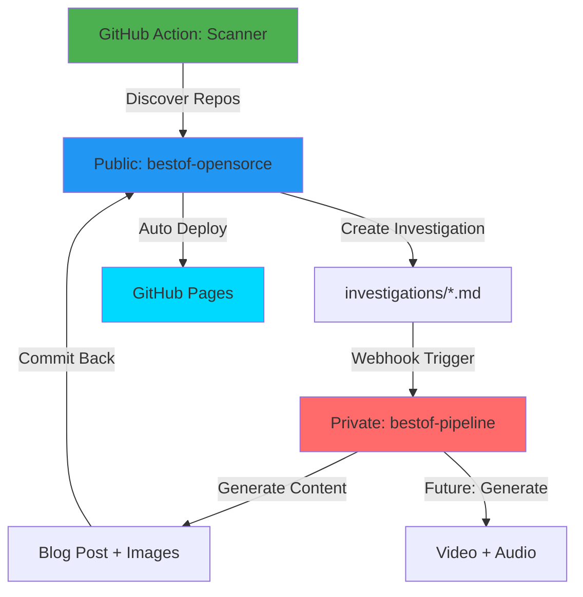

# 📋 Planificación del Proyecto: Best of Open Source

_Última Actualización: 26 de noviembre de 2025 - Arquitectura de Dos Repositorios_

## 1. Visión y Propósito

**Visión:** Crear un ecosistema automatizado que descubra repositorios Open Source destacados, genere contenido educativo en formato blog y videos cortos (reels de 20s), y lo publique automáticamente.

**Propósito:**

- Ayudar a desarrolladores a descubrir herramientas útiles
- Dar visibilidad a creadores de Open Source
- Crear una base de conocimiento persistente (blog + investigations)
- Generar contenido visual atractivo (videos y reels)

**Filosofía:** "Two-Repo Architecture: Public Discovery, Private Content Generation"

- **Repositorio Público:** Scanner, investigations, blog, dashboards
- **Repositorio Privado:** Generación de contenido con IA, APIs, código propietario
- GitHub Actions para descubrimiento y análisis
- Webhook para comunicación entre repositorios
- Reutilización de contenido entre formatos

---

## 2. Arquitectura del Sistema (Dos Repositorios)

### 2.1 Flujo General



### 2.2 Repositorio PÚBLICO (bestof-opensorce)

**URL:** <https://github.com/iberi22/bestof-opensorce>

**Contenido:**

- ✅ `investigations/` - Base de datos Markdown con análisis de repos
- ✅ `website/` - Blog Astro (SSG) con Tailwind + Svelte
- ✅ `web/` - Dashboard React para voice recorder y traducciones
- ✅ `src/scanner/` - Herramientas de descubrimiento de repositorios
- ✅ `src/persistence/` - Capa de almacenamiento local
- ✅ `scripts/run_scanner.py` - Script público de scanning
- ✅ `.github/workflows/` - CI/CD para deploy y scanning

**Características:**

- 🌐 100% Open Source
- 📊 Investigations como database
- 🚀 Deploy automático a GitHub Pages
- 🔍 Scanner ejecutado cada 4 horas
- 📱 Dashboard React para traducciones

### 2.3 Repositorio PRIVADO (bestof-pipeline)

**URL:** <https://github.com/iberi22/bestof-pipeline>

**Contenido:**

- 🔐 `src/blog_generator/` - Generación de posts con Gemini AI
- 🔐 `src/image_gen/` - Creación de thumbnails e imágenes
- 🔐 `api/multilingual_api.py` - API Flask para generación
- 🔐 `api/worker.py` - Procesador de jobs con Redis Queue
- 🔐 `TTS/` - Modelos de Text-to-Speech
- 🔐 `Trainer/` - Checkpoints de modelos
- 🔐 Docker configs y secrets

**Características:**

- 🔒 Código propietario protegido
- 🤖 Integración con Gemini AI
- 🎨 Generación de imágenes con IA
- 📡 Webhook endpoint para recibir eventos
- 🔄 Queue system con Redis

### 2.4 Comunicación Entre Repositorios

**Flujo de Webhook:**

1. **Trigger (Público):**
   - GitHub Action ejecuta scanner
   - Crea/actualiza archivo en `investigations/`
   - Push a rama `main`

2. **Webhook Dispatch:**
   - GitHub webhook envía evento a API privada
   - Payload: `{ "file": "investigations/repo-name.md", "action": "created" }`

3. **Procesamiento (Privado):**
   - API recibe webhook
   - Valida firma de GitHub
   - Encola job de generación
   - Worker procesa: Lee investigation → Genera blog post con IA

4. **Commit Back (Privado → Público):**
   - Clona repo público
   - Crea branch `content/blog-post-name`
   - Commit de archivos generados
   - Push y crea PR (o commit directo a main)

5. **Deploy Automático (Público):**
   - GitHub Action detecta cambios en `website/`
   - Build de Astro
   - Deploy a GitHub Pages

---

## 3. Stack Tecnológico

### Repositorio Público (bestof-opensorce)

**Frontend:**

- **Website:** Astro + Tailwind CSS + Svelte (SSG)
- **Dashboard:** React + Vite + Tailwind
- **Deploy:** GitHub Actions → GitHub Pages

**Backend/Scanner:**

- **Python:** 3.11+
- **APIs:** GitHub REST API
- **Storage:** Local JSON + Markdown files
- **Tests:** pytest

### Repositorio Privado (bestof-pipeline)

**Content Generation:**

- **IA:** Google Gemini API (blog generation)
- **Image Gen:** Gemini Imagen / Stable Diffusion
- **TTS:** edge-tts / Coqui TTS (futuro)
- **Video:** moviepy (futuro)

**API & Workers:**

- **Framework:** Flask
- **Queue:** Redis + RQ (Redis Queue)
- **Storage:** Local filesystem
- **Deploy:** Docker (futuro: Cloud Run / Railway)

---

## 4. Formato del Contenido

### 4.1 Post del Blog (Markdown)

```markdown
---
layout: post
title: "Repo Name - Solución para X"
date: 2025-11-23
repo: owner/repo-name
stars: 1234
language: Python
tags: [tag1, tag2]
images:
  architecture: /assets/images/repo-name/architecture.png
  screenshot: /assets/images/repo-name/screenshot.png
  flow: /assets/images/repo-name/flow.png
video: /assets/videos/repo-name-reel.mp4
---

## 🎯 Problema
[Hook]

## 💡 Solución
[Solution]

## ✅ Ventajas
- [Pros]

## ⚠️ Consideraciones
- [Cons]

## 🎬 Veredicto
[Verdict]
```

### 4.2 Reel de 20 Segundos

```
Timeline:
00:00-00:03  │ Intro (Logo + Título)
00:03-00:08  │ Problema (Diagrama flow)
00:08-00:13  │ Solución (Screenshot web)
00:13-00:17  │ Arquitectura (Diagrama)
00:17-00:20  │ Outro (CTA + Link blog)
```

**Elementos:**

- 3 imágenes generadas (architecture, flow, screenshot)
- Narración condensada (20s)
- Transiciones suaves
- Música de fondo (opcional)
- Overlay de texto con highlights

---

## 5. Roadmap de Implementación

### ✅ Fase 0-9: Fundamentos (COMPLETADO)

- [x] Scanner de GitHub
- [x] Integración con Gemini
- [x] Generación de imágenes
- [x] Firebase persistence
- [x] Tests básicos
- [x] Blog Generator
- [x] Reel Creator
- [x] Voice Translation
- [x] CI/CD Pipeline

### 🔧 Fase 10: Enhanced Repository Analysis (EN PROGRESO - 2 días)

**Objetivo:** Análisis profundo con métricas avanzadas y clasificación inteligente

**Componentes Nuevos:**

```
src/scanner/
├── insights_collector.py      # 15+ métricas de GitHub Insights API
├── repo_classifier.py          # Detecta proyectos reales vs mocks/tutorials
├── category_detector.py        # Taxonomía automática (10 categorías)
└── adoption_metrics.py         # npm/PyPI/Docker stats
```

**Métricas Recopiladas (15+):**

1. **Actividad:**
   - Commits per week
   - Issue velocity (issues cerrados/semana)
   - PR merge rate (% PRs mergeados)
   - Release frequency (releases/mes)

2. **Adopción Real:**
   - npm downloads (último mes)
   - PyPI downloads (última semana)
   - Docker Hub pulls
   - GitHub dependents count
   - Sponsors/funding

3. **Calidad:**
   - Contributors count
   - CI/CD status
   - Critical issues (security, breaking bugs)
   - Code coverage (si disponible)
   - Documentation quality score

4. **Comunidad:**
   - PR response time (promedio en horas)
   - Issue response time
   - % de PRs externos mergeados
   - Diversity de contributors

**Taxonomía de Categorías (10):**

1. 🤖 **AI/ML & Data Science** - Frameworks ML, NLP, Computer Vision
2. 🔒 **Cybersecurity** - Pentesting, Security auditing, Encryption
3. 🎨 **UI/UX & Frontend** - Component libraries, Design systems
4. 🌐 **Web Frameworks** - REST/GraphQL APIs, Full-stack
5. 💾 **Databases & Storage** - SQL/NoSQL, ORMs, Vector DBs
6. ⚙️ **DevOps & Infrastructure** - CI/CD, Containers, IaC
7. 📱 **Mobile Development** - Cross-platform, Native tools
8. 🧪 **Testing & QA** - Test frameworks, E2E, Load testing
9. 📊 **Analytics & Observability** - Logging, Tracing, APM
10. 🛠️ **Developer Tools** - CLI utils, Code generators, Linters

**Algoritmo de Clasificación:**

```python
def classify_repo(repo: dict) -> dict:
    """
    Returns:
    {
        'categories': ['ai_ml', 'python'],  # Múltiples categorías
        'is_real_project': True,
        'confidence_score': 0.92,
        'signals': {
            'positive': ['high npm downloads', 'many dependents', ...],
            'negative': ['contains tutorial keyword']
        }
    }
    """
```

**Señales de Proyecto Real:**

- ✅ Package downloads > 10K/month
- ✅ Dependents > 50 proyectos
- ✅ Contributors > 10
- ✅ Issues cerrados > 100
- ✅ Releases regulares (> 1 cada 3 meses)
- ✅ Documentation site dedicado
- ✅ Sponsors/funding activo

**Señales de Mock/Tutorial:**

- ❌ Nombre contiene: "example", "demo", "tutorial", "starter"
- ❌ Solo 1-2 contributors
- ❌ Sin releases
- ❌ Descripción dice "learning project"
- ❌ Commits solo del owner

| Tarea | Descripción | Estimación |
|-------|-------------|------------|
| 10.1 | Expandir GitHubScanner con Insights API | 2 horas |
| 10.2 | Implementar RepoClassifier | 3 horas |
| 10.3 | Sistema de taxonomía automática | 2 horas |
| 10.4 | Integración con npm/PyPI/Docker APIs | 2 horas |
| 10.5 | Tests unitarios | 1 hora |

**Total:** 10 horas / 2 días

---

### 🎨 Fase 11: Blog UI Redesign con Fira Code (SIGUIENTE - 1 día)

**Objetivo:** Diseño moderno, arreglo de imágenes, Fira Code

**Mejoras Visuales:**

- 🔤 **Fira Code** como fuente principal (con ligatures)
- 🌑 **Dark Theme** glassmorphism moderno
- 🖼️ **Fix Crítico:** Rutas de imágenes con `{{ site.baseurl }}`
- 🎨 **Color Palette:**
  - Background: `#0a0e27`
  - Cards: `#1a1f3a`
  - Accent: `#00d9ff`
  - Text: `#e4e4e7`

**Componentes CSS:**

```css
/* main.css - Variables globales */
:root {
    --font-primary: 'Fira Code', monospace;
    --font-size-base: 16px;
    --color-primary: #00d9ff;
    --color-bg: #0a0e27;
    --color-card: #1a1f3a;
    --color-text: #e4e4e7;
    --color-text-muted: #94a3b8;
}

/* Glassmorphism effect */
.card {
    background: rgba(26, 31, 58, 0.6);
    backdrop-filter: blur(10px);
    border: 1px solid rgba(255, 255, 255, 0.1);
    border-radius: 12px;
    box-shadow: 0 8px 32px rgba(0, 0, 0, 0.3);
}
```

**Inspiración:** GitHub Dark + Vercel + Railway

| Tarea | Descripción | Estimación |
|-------|-------------|------------|
| 11.1 | Integrar Fira Code (Google Fonts) | 30 min |
| 11.2 | Dark theme glassmorphism | 3 horas |
| 11.3 | ⚠️ CRÍTICO: Arreglar rutas de imágenes | 1 hora |
| 11.4 | Syntax highlighting mejorado | 1 hora |
| 11.5 | Responsive design refinado | 1 hora |

**Total:** 6.5 horas / 1 día

---

### 🗂️ Fase 12: Multi-Category Navigation System (FUTURO - 1 día)

**Objetivo:** Sistema de filtrado y navegación por categorías

**Características:**

- 🔍 **Filtrado dinámico** sin recarga de página
- 🏷️ **Badges visuales** por categoría (con emoji + color único)
- 📑 **Página de índice** organizada por categorías
- 🔗 **Deep linking** con URL hash (#category=ai_ml)
- 📊 **Contador** de posts por categoría

**Estructura:**

```
blog/
├── categories.html              # Página principal con filtros
├── _includes/
│   ├── category-badge.html     # Componente de badge
│   └── category-icon.html      # Íconos por categoría
└── assets/
    └── js/
        └── category-filter.js  # Lógica de filtrado
```

| Tarea | Descripción | Estimación |
|-------|-------------|------------|
| 12.1 | Página de categorías con filtros | 2 horas |
| 12.2 | JavaScript de filtrado dinámico | 1 hora |
| 12.3 | Sistema de badges visuales | 1 hora |
| 12.4 | Índice organizado por categoría | 1 hora |
| 12.5 | SEO optimization por categoría | 1 hora |

**Total:** 6 horas / 1 día

---

### 📊 Fase 13: Advanced Analytics Dashboard (BACKLOG - 1-2 días)

**Objetivo:** Dashboard de métricas y health indicators

**Componentes del Dashboard:**

1. **Repo Metrics Card:**

   ```
   ⭐ 12,500 Stars        👥 45 Contributors
   📦 450K Downloads      🔄 28 Commits/week
   ✅ 85% PR Merge Rate   📈 0.8 Releases/month
   ```

2. **Production Ready Score:**
   - Medidor circular (0-100%)
   - Color coding: 🔴 < 50%, 🟡 50-80%, 🟢 > 80%
   - Tooltip con breakdown detallado

3. **Critical Issues Alert:**

   ```
   ⚠️ 2 Security Vulnerabilities Reported
   - CVE-2024-1234: SQL Injection in auth module
   - Issue #456: Memory leak in worker process
   ```

4. **Growth Charts (Chart.js):**
   - Stars over time (últimos 6 meses)
   - Commit activity timeline
   - Issue velocity trend

| Tarea | Descripción | Estimación |
|-------|-------------|------------|
| 13.1 | Componente de métricas detalladas | 2 horas |
| 13.2 | Gráficos de tendencias (Chart.js) | 3 horas |
| 13.3 | Alertas de issues críticos | 1 hora |
| 13.4 | Score visual de "Production Ready" | 1 hora |

**Total:** 7 horas / 1-2 días
**Objetivo:** Crear sistema de generación de blog

| Tarea | Descripción | Estimación |
|-------|-------------|------------|
| BG-01 | Crear estructura `blog/` | 0.5 días |
| BG-02 | Implementar `MarkdownWriter` | 1 día |
| BG-03 | Implementar `BlogManager` (Git ops) | 1 día |
| BG-04 | Crear GitHub Workflow `scan-and-blog.yml` | 1 día |
| BG-05 | Configurar Jekyll para GitHub Pages | 0.5 días |
| BG-06 | Tests de Blog Generator | 0.5 días |

**Total:** 4.5 días

| Tarea | Descripción | Estimación |
|-------|-------------|------------|
| AL-01 | Implementar `BlogWatcher` | 1 día |
| AL-02 | Script `generate_video_from_post.py` | 0.5 días |
| AL-03 | Integración con uploader | 0.5 días |
| AL-04 | Tests de automatización | 0.5 días |

**Total:** 2.5 días

### 🎨 Fase 4: GitHub Pages & UI (Prioridad MEDIA)

**Objetivo:** Blog visualmente atractivo

| Tarea | Descripción | Estimación |
|-------|-------------|------------|
| UI-01 | Layouts personalizados Jekyll | 1 día |
| UI-02 | CSS/Estilos modernos | 1 día |
| UI-03 | Página de índice con búsqueda | 0.5 días |
| UI-04 | Integración de videos en posts | 0.5 días |

**Total:** 3 días

---

## 6. Componentes Principales

### 6.1 Blog Generator (`src/blog_generator/`)

```python
class MarkdownWriter:
    """Genera posts en Markdown con frontmatter YAML"""
    def create_post(repo_data, script_data, images) -> str
    def _format_frontmatter(metadata) -> str
    def _format_content(script_data) -> str

class BlogManager:
    """Gestiona operaciones Git para el blog"""
    def create_branch(post_name) -> str
    def commit_files(files) -> bool
    def create_pull_request() -> str
    def auto_merge() -> bool
```

### 6.2 Reel Creator (`src/video_generator/`)

```python
class ReelCreator:
    """Crea reels de 20 segundos"""
    def create_reel(post_md, images, screenshot) -> str
    def _create_timeline() -> Timeline
    def _add_narration(audio_path) -> None
    def _add_transitions() -> None
    def _render_final() -> str

class ScreenshotCapturer:
    """Captura screenshots de repos"""
    def capture_repo_page(url) -> str
    def capture_highlights(sections) -> List[str]
```

### 6.3 Blog Watcher (`scripts/watch_blog.py`)

```python
class BlogWatcher:
    """Monitorea cambios en blog/_posts/"""
    def watch() -> None
    def on_new_post(post_path) -> None
    def trigger_video_generation(post) -> None
```

---

## 7. Ventajas de esta Arquitectura

### 📚 Blog como Base de Datos

- ✅ Historial completo versionado (Git)
- ✅ Búsqueda fácil (Markdown)
- ✅ Portable y respaldable
- ✅ Gratis (GitHub Pages)

### 🔄 Reutilización de Contenido

- ✅ Un análisis → Blog + Video
- ✅ Imágenes compartidas
- ✅ Narración adaptable

### 💰 Costo Cero

- ✅ GitHub Actions (2000 min/mes gratis)
- ✅ GitHub Pages (hosting gratis)
- ✅ Generación local (sin costos cloud)

### 📈 Escalabilidad

- ✅ Fácil agregar más fuentes
- ✅ Fácil cambiar formato de video
- ✅ Fácil agregar más plataformas

---

## 8. Métricas de Éxito

### Fase 1 (Blog Generator)

- [ ] 10 posts generados automáticamente
- [ ] Blog publicado en GitHub Pages
- [ ] Workflow corriendo sin errores

### Fase 2 (Reel Creator)

- [ ] 5 reels de 20s generados
- [ ] Calidad visual profesional
- [ ] Narración sincronizada

### Fase 3 (Automatización)

- [ ] Detección automática de nuevos posts
- [ ] Generación de video sin intervención manual
- [ ] Upload automático a YouTube

---

## 9. Estándares de Desarrollo

- **Código:** PEP 8, Type Hints obligatorios
- **Commits:** Conventional Commits (`feat:`, `fix:`, `docs:`)
- **Tests:** Cobertura mínima 80%
- **Documentación:** Docstrings Google Style
- **Blog Posts:** Frontmatter YAML + Markdown
- **Videos:** 1080p, 20s, formato vertical (9:16) o cuadrado (1:1)

---

**Próximo Paso:** Implementar Fase 1 (Blog Generator)
