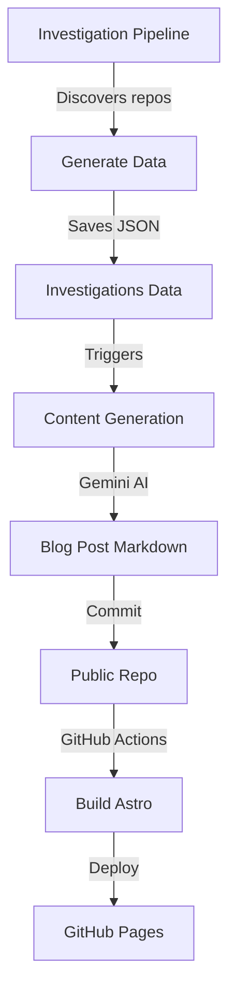

# 📝 Blog Configuration Guide

This guide explains the Astro blog setup, content collections, and deployment process.

## 📁 Directory Structure

```
website/
├── src/
│   ├── content/
│   │   ├── blog/               # Blog posts (Markdown/MDX)
│   │   │   ├── 2025-11-23-example-post.md
│   │   │   └── 2025-11-23-test-automation-tool.md
│   │   └── config.ts           # Content collection schema
│   ├── pages/
│   │   ├── blog/
│   │   │   ├── index.astro     # Blog listing page
│   │   │   └── [...slug].astro # Dynamic blog post pages
│   │   └── index.astro         # Homepage
│   ├── layouts/
│   │   └── BlogPost.astro      # Blog post layout
│   └── components/
│       └── BlogCard.svelte     # Blog post preview component
├── public/
│   └── images/                 # Static images for blog posts
├── astro.config.mjs            # Astro configuration
└── package.json
```

---

## 🎨 Content Collection Schema

The blog uses Astro's content collections with the following schema:

```typescript
// website/src/content/config.ts
const blogCollection = defineCollection({
  type: "content",
  schema: z.object({
    title: z.string(),                          // Required: Post title
    date: z.coerce.date().optional(),           // Publication date
    description: z.string().optional(),         // Short description
    repo: z.string().optional(),                // GitHub repo (e.g., "owner/repo")
    stars: z.number().optional(),               // GitHub stars count
    language: z.string().optional(),            // Primary language
    repo_data: z.object({                       // Full repository data
      full_name: z.string(),
      description: z.string().optional(),
      stars: z.number().optional(),
      language: z.string().optional(),
      url: z.string().optional(),
      owner: z.string().optional(),
    }).optional(),
    categories: z.array(z.string()).optional(), // Post categories
    tags: z.array(z.string()).optional(),       // Post tags
    images: z.record(z.string()).optional(),    // Image URLs
    video: z.string().optional(),               // Video URL
    production_metrics: z.record(z.any()).optional(),
    critical_issues: z.array(z.any()).optional(),
  }),
});
```

---

## ✍️ Creating Blog Posts

### Option 1: Manual Creation

Create a new Markdown file in `website/src/content/blog/`:

```markdown
---
title: "Amazing Project - Solving Developer Pain Points"
date: 2025-11-26
repo: owner/awesome-project
stars: 1234
language: Python
description: "A revolutionary tool for automating deployments"
tags: [automation, devops, ci-cd]
images:
  architecture: /images/awesome-project/architecture.png
  screenshot: /images/awesome-project/screenshot.png
---

## 🎯 The Problem

Developers spend countless hours on manual tasks...

## 💡 The Solution

This project automates everything...

## ✅ Advantages

- Fast and efficient
- Easy to use
- Well documented

## ⚠️ Considerations

- Requires setup
- Learning curve

## 🎬 Verdict

Highly recommended for teams looking to improve productivity.
```

### Option 2: Automated Generation

Blog posts are automatically generated by the investigation pipeline:

1. **Investigation pipeline** discovers new repositories
2. **Gemini AI** generates blog post content
3. **manage_investigations.py** creates Markdown files
4. **GitHub Actions** commits to repo
5. **Webhook** (optional) triggers content generation in private repo

---

## 🚀 Development

### Install Dependencies

```bash
cd website
npm install
```

### Start Dev Server

```bash
npm run dev
```

Visit: http://localhost:4321/bestof-opensorce/

### Build for Production

```bash
npm run build
```

Output: `website/dist/`

### Preview Production Build

```bash
npm run preview
```

---

## 🌐 Deployment

### GitHub Pages (Automatic)

The blog automatically deploys to GitHub Pages via GitHub Actions.

**Workflow File:** `.github/workflows/deploy-blog.yml`

**Triggers:**
- Push to `main` branch with changes in `website/`
- Manual workflow dispatch

**URL:** https://iberi22.github.io/bestof-opensorce/

### Manual Deployment

```bash
cd website
npm run build
# Upload dist/ folder to any static hosting service
```

---

## 📊 Content Migration

### Migrating Investigations to Blog Posts

Use the migration script to convert investigation data to blog posts:

```bash
python scripts/migrate_investigations_to_blog.py
```

The script:
1. Reads investigation JSON files from `opencut_projects/`
2. Converts to Markdown with proper frontmatter
3. Saves to `website/src/content/blog/`
4. Generates SEO-friendly slugs

**Note:** Currently the `opencut_projects/` directory contains video editor projects, not investigation data. When actual investigation data is available, this script will convert it properly.

---

## 🔄 Automated Workflow

### Full Pipeline



### Webhook Integration

When enabled, the webhook provides real-time updates:

1. **Public repo** commits changes to investigations
2. **Webhook** fires and notifies private repo
3. **Private repo** generates enhanced content
4. **Results** committed back to public repo
5. **GitHub Actions** rebuilds and deploys

See [WEBHOOK_SETUP_GUIDE.md](WEBHOOK_SETUP_GUIDE.md) for configuration.

---

## 🎨 Customization

### Styling

The blog uses Tailwind CSS. Customize in:
- `tailwind.config.mjs` - Tailwind configuration
- `src/layouts/BlogPost.astro` - Blog post layout
- `src/components/BlogCard.svelte` - Post preview cards

### SEO

Update metadata in blog post frontmatter:
```yaml
---
title: "Your Post Title"
description: "SEO-friendly description"
---
```

### Site Configuration

Edit `astro.config.mjs`:
```javascript
export default defineConfig({
  site: 'https://iberi22.github.io',
  base: '/bestof-opensorce',
  // ... other config
});
```

---

## 📝 Content Guidelines

### Writing Blog Posts

1. **Title:** Clear, descriptive, actionable
2. **Structure:** Use consistent sections (Problem, Solution, Advantages, etc.)
3. **Length:** 300-1000 words optimal
4. **Code blocks:** Use proper language tags for syntax highlighting
5. **Images:** Optimize before uploading, use descriptive filenames
6. **Links:** Use relative links for internal content

### Frontmatter Best Practices

```yaml
---
# Required
title: "Clear, descriptive title"

# Recommended
date: 2025-11-26
description: "Brief summary for SEO and social sharing"
tags: [relevant, tags, here]

# Optional but useful
repo: owner/repo-name
stars: 1234
language: Python
images:
  hero: /images/post-name/hero.png
---
```

---

## 🐛 Troubleshooting

### Issue: Content collection not found

**Solution:**
```bash
rm -rf .astro
npm run dev
```

### Issue: Images not loading

**Solution:**
- Place images in `public/images/`
- Use absolute paths: `/images/filename.png`
- Don't use `/bestof-opensorce` prefix (handled automatically)

### Issue: Build fails with type errors

**Solution:**
```bash
npm run astro check
```
Fix any TypeScript errors in frontmatter.

### Issue: Dev server port conflict

**Solution:**
```bash
npm run dev -- --port 4322
```

---

## 📚 Resources

- [Astro Documentation](https://docs.astro.build/)
- [Content Collections Guide](https://docs.astro.build/en/guides/content-collections/)
- [Markdown Guide](https://www.markdownguide.org/)
- [Tailwind CSS](https://tailwindcss.com/)
- [Svelte Documentation](https://svelte.dev/)

---

## 🤝 Contributing

To add a blog post:

1. Fork the repository
2. Create post in `website/src/content/blog/`
3. Follow naming convention: `YYYY-MM-DD-slug.md`
4. Include proper frontmatter
5. Test locally: `npm run dev`
6. Submit pull request

---

**Last Updated:** 2025-11-26
