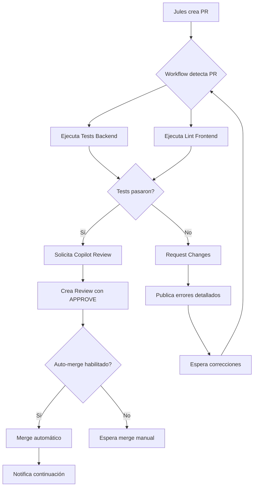

# Sistema de Automatización de PRs para Jules

Sistema completo para detectar, revisar e integrar automáticamente Pull Requests creados por Jules CLI, con soporte para múltiples fases y continuación de tareas.

## 🎯 Características

### 1. **Detección Automática de PRs**
- Detecta automáticamente PRs creados por `google-labs-jules[bot]`
- Se activa al abrir, sincronizar o reabrir un PR
- Funciona solo en PRs dirigidos a la rama `main`

### 2. **Revisión Automática de Código**
El sistema ejecuta automáticamente:
- ✅ **Tests Backend**: Ejecuta `pytest` en todos los tests
- ✅ **Lint Frontend**: Ejecuta `npm run lint` en el website
- ✅ **GitHub Copilot Review**: Solicita revisión automática de Copilot
- ✅ **Análisis de Resultados**: Determina si aprobar o rechazar

### 3. **Integración Automática**
- **Auto-merge**: Si todos los tests pasan, el PR se mergea automáticamente usando "squash merge"
- **Comentarios Informativos**: Publica resultados detallados de la revisión
- **Aprobación/Rechazo**: Aprueba o solicita cambios según los resultados

### 4. **Sistema de Múltiples Fases**
- Detecta cuando un PR es parte de una tarea Jules con múltiples fases
- Proporciona instrucciones para continuar con la siguiente fase
- Script CLI para facilitar la continuación de tareas

## 📋 Requisitos Previos

1. **GitHub Actions habilitado** en el repositorio
2. **Permisos necesarios**:
   - `contents: write` - Para mergear PRs
   - `pull-requests: write` - Para crear reviews y comentarios
   - `checks: read` - Para leer resultados de checks
   - `statuses: read` - Para leer estados de CI

3. **GitHub CLI (gh)** instalado localmente para usar el script de continuación

## 🚀 Instalación

### Paso 1: Archivo de Workflow Ya Está Creado
El workflow está en `.github/workflows/auto-pr-review.yml`

### Paso 2: Configurar Secrets (Opcional)
Si quieres usar un Personal Access Token personalizado:

```bash
gh secret set GH_PAT --body "tu_github_pat_aqui"
```

Por defecto usa `GITHUB_TOKEN` que viene automáticamente.

### Paso 3: Instalar GitHub CLI (Para continuación de tareas)

**Windows (PowerShell):**
```powershell
winget install GitHub.cli
```

**macOS:**
```bash
brew install gh
```

**Linux:**
```bash
# Ubuntu/Debian
sudo apt install gh

# Fedora/CentOS
sudo dnf install gh
```

Autenticar con GitHub:
```bash
gh auth login
```

## 💻 Uso

### Flujo Automático

Cuando Jules crea un PR automáticamente:

1. **Se abre el PR** → El workflow se activa automáticamente
2. **Se ejecutan los tests** → Backend y frontend
3. **Se analiza** → Se determinan resultados
4. **Se revisa** → GitHub Copilot + Automated Review
5. **Se decide**:
   - ✅ Si pasa todo → Auto-merge + Notificación de continuación
   - ❌ Si falla algo → Request Changes + Detalles de errores

### Continuación Manual de Tareas (Múltiples Fases)

#### Ver estado del último PR de Jules:
```bash
python scripts/jules_continue.py status
```

#### Crear issue para siguiente fase:
```bash
python scripts/jules_continue.py continue --prompt "Implementar la siguiente feature: autenticación de usuarios con OAuth2"
```

#### Comentar en un PR específico:
```bash
python scripts/jules_continue.py comment --pr-number 5 --message "Por favor continúa con los tests de integración"
```

### Ejemplos de Uso Completo

**Escenario 1: Tarea con 3 fases**

```bash
# Fase 1: Jules crea PR automáticamente
# El sistema lo detecta, revisa y mergea automáticamente

# Fase 2: Continuar con siguiente fase
python scripts/jules_continue.py continue --prompt "Fase 2: Añadir documentación API y ejemplos de uso"

# Jules crea nuevo PR para fase 2
# El sistema lo detecta, revisa y mergea

# Fase 3: Última fase
python scripts/jules_continue.py continue --prompt "Fase 3: Crear tests end-to-end y actualizar README"

# Jules completa la tarea
```

**Escenario 2: PR necesita cambios**

Si un PR falla los tests:
1. El workflow solicita cambios automáticamente
2. Publica detalles de los errores en comentario
3. Jules puede ver los errores y crear un nuevo commit
4. Al hacer push, el workflow se ejecuta nuevamente

## 🔧 Configuración Avanzada

### Personalizar Criterios de Aprobación

Edita `.github/workflows/auto-pr-review.yml`:

```yaml
# Añadir más checks
- name: Run Security Scan
  run: |
    pip install bandit
    bandit -r src/ > security-results.txt
```

### Cambiar Método de Merge

Por defecto usa `squash`, pero puedes cambiarlo:

```yaml
merge_method: 'merge'  # o 'rebase' o 'squash'
```

### Deshabilitar Auto-merge

Comenta o elimina el step `Auto-merge if approved`:

```yaml
# - name: Auto-merge if approved
#   if: steps.analyze.outputs.should_approve == 'true'
#   ...
```

### Añadir Revisores Humanos

```yaml
- name: Request Human Review
  if: steps.analyze.outputs.should_approve == 'false'
  run: |
    gh pr edit ${{ github.event.pull_request.number }} \
      --add-reviewer @tu-usuario
```

## 📊 Flujo de Trabajo Completo



## 🛡️ Seguridad

### Limitaciones de Seguridad Implementadas:

1. **Solo bots autorizados**: El workflow solo se ejecuta para PRs de `google-labs-jules[bot]`
2. **Branch protegido**: Solo acepta PRs a `main`
3. **Tests obligatorios**: Requiere que pasen tests antes de merge
4. **Review requerida**: GitHub Copilot + Automated Review

### Recomendaciones Adicionales:

1. **Branch Protection Rules**: Configura reglas de protección en GitHub:
   - Settings → Branches → Add rule para `main`
   - Require pull request before merging
   - Require status checks to pass
   - Require review from Code Owners

2. **CODEOWNERS**: Crea `.github/CODEOWNERS`:
```
# Requiere review del owner para archivos críticos
/src/            @iberi22
/.github/        @iberi22
/requirements.txt @iberi22
```

## 🐛 Troubleshooting

### El workflow no se ejecuta
- Verifica que el archivo esté en `.github/workflows/auto-pr-review.yml`
- Revisa que los permisos estén configurados correctamente
- Verifica en Actions → Workflows que esté habilitado

### Los tests fallan pero deberían pasar
- Ejecuta localmente: `pytest tests/`
- Revisa los logs detallados en Actions
- Verifica que todas las dependencias estén en `requirements.txt`

### El auto-merge no funciona
- Verifica que tengas permisos de `contents: write`
- Revisa si hay branch protection rules que lo bloquean
- Chequea los logs del step "Auto-merge if approved"

### El script de continuación no funciona
```bash
# Verifica que gh esté instalado
gh --version

# Verifica autenticación
gh auth status

# Verifica que estás en el directorio correcto
cd /ruta/al/repo
```

## 📚 Recursos Adicionales

- [GitHub Actions Documentation](https://docs.github.com/en/actions)
- [GitHub CLI Manual](https://cli.github.com/manual/)
- [Jules AI Documentation](https://jules.google.com/)
- [GitHub Copilot Code Review](https://docs.github.com/en/copilot/using-github-copilot/code-review/using-copilot-code-review)

## 🤝 Contribuciones

Este sistema puede ser mejorado. Algunas ideas:

- [ ] Añadir soporte para más tipos de tests (coverage, performance, etc.)
- [ ] Integrar con servicios externos (Slack, Discord notificaciones)
- [ ] Dashboard web para visualizar el estado de PRs Jules
- [ ] Machine learning para predecir tiempo de merge
- [ ] Integración con Jules para feedback directo

## 📝 Changelog

### v1.0.0 (2025-11-27)
- ✨ Sistema inicial de detección y revisión automática
- ✨ Auto-merge para PRs que pasan tests
- ✨ Script de continuación para múltiples fases
- ✨ Integración con GitHub Copilot Reviews
- 📚 Documentación completa

## 📄 Licencia

Este sistema forma parte del proyecto bestof-opensource.
Usa las mismas condiciones de licencia del proyecto principal.

---

**Creado con ❤️ para automatizar el flujo de trabajo de Jules + GitHub**
